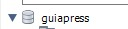

# Projeto Blog - Guia do Programador

## Projeto feito com node.js e view engine ejs, para aprender node.js
## integrando a um banco de dados (mysql) usando como interface de banco (mysql-workbench 8.0) 

## a interação entre o back e a base foi feita via (sequelize)
![Badge](data:image/png;base64,iVBORw0KGgoAAAANSUhEUgAAAUEAAACdCAMAAAAdWzrjAAABDlBMVEX///8xQWs1er4+r/A+sPAgNGM1fsSbo7Y2er+zuMcuPm2Hjqb0+Pz7+/2uyOYjcrvKztgUKmEwPGUjNGbY2uPu7/M1RHF5gZwzTnsSKWFocZEWLV8dMGTl5+0yVYgAG1kAFVfBxdEGI10pq/EwN2A/uPrc5/NQW4Cqr7/Q1N0AH1vR7P224Pzw+f80c7hyepfQ3u6X0/p9yfnj9P41Y5Q8o+Q1bqA4isxbZYdCTnY0Qm+SmK2fpLfD1uxilc0ObLpZvPep2/vI6v8TnOcUkNUXHVAVY587lNU5frM9ndhwxPix1fEyXZYAdrc2Z5k9qOUAAEwAAEk5jsc2erAxT4WVttxSi8iBqdYYR4KNsNrt6TrWAAAKxElEQVR4nO2bCVva2BqAA4QQEhCSEDBwEMgiSy3YugFqtc7itNM7be3U3vn/f+SeFbJQqxVvdPzeeWYs5Ijwzne+5cRKEgAAAAAAAAAAAAAAAAAAAAAAAAAAAAAAAAAAAAAAAAAAAAAAAACsi73z4EXa7+Ep8/K1l8t5r/fSfh9Plreel5Nz2OGrtN/J02QnwAHI8HI7ab+bp8eL84U/6vAc0uGdoAkwivf6Zdrv6gnxKuJP5v+FdHhbLmgClONBiMMwgHR4C8IJMGxRhnR4K0rLBCiv8gjp8Ae88pYbWGb/enGJkA6/T6gDFLbe77FdLROJMqTDG9kjqqI7NrggF3ZYHIaueecw6CVIdICy570ldYVYfMXHu2VehHQYB4/AcjgAZeqInSzggGN++XWZKiR+AcFFLrGB3+9xrTzgXrxP5Ej5Iu33/VjYO0/IIVv3Inyy8JZrhnSYJJ4A8f6V3zKtoaikTt/mvFiPDelwuVNDReJVSZK2f4mFZfBrL24b0iFh+9fY7OG9fynt7UjbZ0fhcAvk/d96UglfiqXDQP7dTvszpEu7kj0IQpsVz70l3Luc/1lRx5fCoRz84ZutHk6EJB2eh9JhcOVbz9zgdiU7VoRDz9sR/bN3kB2rXG5wlfEz/pbs8ZOFHY/HYfBu0888d4M4BtXs+GhxO+SFKMCyfJlVx8pHmWryN98FvHaQNoeeHwYf9/1M5tkbxDFIuZQXHfQyLR6Ns+PLQ980/atgkRU9IhqnQ/mLb2KBmTwYpKiVP9m9uUiZyOELZsY8zAXhpz0Zb/aNPAlAiEFsUMXbGFPZkEo8IYrxLsgdflAUM1M/kKMH1sF/qlIhzwRCDPIYpAZVnhC5pyvf/6Cqf/l1XFJC5wo4Mf4WMggxGDaIi8qlLNOIC97V/Yz54VLGBUMl9Zo7pPWj9Z0YtNvDWttej9JyY1IlX9vt8lpe76GIGqR/IluZ1Vl/6yPe0XKAOxtcr4nYIKD1o7UyBov9PHIcZGn9afv+76xsjYr4i+10e/d/sQdkhcEx3rO4AOMeEHcwMj2ali9ZeJKNTaytjMGpaznWbKZhi5/WYVAzuMHq/V/sAYnvYlKWsyruAE3/jyCU/Ghnc7TJ6++qGBwYVr9ql8s23sqDNWw8YVDXa/d/sQdkRQxms8om7mDkSAeDHSpZxcwkDfIYLM+s/lrfGTf46IkZVBcGjw4iHQzewFuKkllhkMegjdBgre/sSRpUWHNNDYpRjzWHZLT7kUFjRcavVau10I4uk8e4WtOnyosLyz+F1guDZb54AV9qD6vDx9BIJXaxymOQlJRL0VrTyvzDGDyJv/jA6mAcnX/oWtMZkSdGXR0/ane6Q/Z8r2uV2HqNXHZ1+kjkQZfU4tonJGCFpTYddbqdUT/9HBk2WD6qLPMgH5dxNeEdTNhgd1Ue1Oql6Gs3XANNGnMHzejDoWEZzrQ5rWsWNYgc/vF7DvtO3UV4fR2vJ8qFQcvByoafXYqjaW6VvdZo2iDVP/VCvRsyKElfWTVeGiQnX7yDWRrMz3BUJLqZE0dDhXAX0+sYBfK1aBg0OjXNYomtacQMGtRgdYSO2UODfI0YxBWe0p5rc/zzynOrT36sPbO0h3d0M1GD0gVuWpYG6a7e5x2MMGjm6edMdtSTkYWcWWMgLDbRhP1BR6RK91xRGRIGWQxOUFOsn0sxg4Kp5QzpdyD2U2uuO3wAK3eBGVSZwdIrTz5QxsSgnxWdzVYmbND093MBuTWyYiapTpGBkGH06UfGpYV/uKqBsFXdQnydMGhEYrBsObwUDR2nvdpgwXBpwV/Iluao8FBqbkk4BksHpPLiGQ531IcKP/VStkQTuKUq/KTVk9urTxbsnj5FSOuQKK054gqWUCPhIz716hisuQZfX0Ik0FYYrLoWC+uZITqnJmo8lJpbwg2q1OBY+RjQ0+n9g0ARdVnEoHnoKeSkFc/JV6vnYoY9QFq3RrxowxqlqhEJU6TzFYkYpAaHDuLrhxZpjJIGbaTVWVnHkceWtpuLaEyL3Wg3w5pAPI7IymIX8xg0/wrkIGCt4U0GSTSRklA0tE6X0rFG2FXfEN3OwqDoZqjBXnh9dZXBvuWyHFtGmsGWdpFItqmxm5jq2B26QFFiBv3DgJ264tbmZoPSzGpQgw3BBH/yPqu0UmgXczXMYNWJrk8Y1NFIDCmWNV0sXe8kdHeSBslxapDb9z8oYYNm5ndyckhue67uqMNMSXLCu7iUeJLCDVpRg0PHiKyPGyy6izQgzZ3HM/DtVtTETDI+Ip78TdzZqCwPmv4huXBwVfe/N5OE0chnbTsoMjBMkDh5YAZtTYyBzGDbdSLrYwbbo9DJxWwpM3WSMcj6wYz/BVdl0tngGCQdTO4I2xSt4c0Gh7TzK82jY94JcnmMMYNYA9/WVdYPzhfbnBI1WJ5ZaPmDjlF9nRLuxQqD9GTBJ/NcjnQ2W6yDkYMv6sq5WMwkttiDtblmkJLZsKxwUNU6vBWxeVWeWHNaWe0GogZ1ZIVHtKjBCbJCrfPQjdpOk+/FoMnujODO5m96rzi4yvx948mCNJ1Pmw29cDzF/SDN7rWuZjUGxcGgoNOP27dQvzDA1y06F0vFkVY/xo8NxCbqtquhCVtPrkcM4teqNzHT6ZQeJkzxa53gpSfHzbTPZyL9YNhgdtHZ0Fjc9H9wNlOe4bkfYxgOH3+lnoUfuKNRp0szWGnqGobruvUZMyhNXIQfj2aTEaLxO0RkvdvpdMmwWzY+k/8R9ugTPZuh30r4RDc1fi28dNQZfU77dOY0HIOiqizm4kt2247eNgkbNFbEoN3u4ZDQ9ZPeoqTaRX3S0E8GRT4qV48njUJPmhi8DlQLjUahWraLxXJofWFQpFaK9NvK9Is9KC6w+fdOJvrxoFhN+05e2KB0qlQiBmlnIzqYkMFWvy2d/Pz94qbxeCrp/aEGVX6yIJW/VpZnMzQgx0fvxO0lYTA/J7tUB4MMYpCX4K/ksf3mLHw+GJpJuEHTOSbHAH0hEAyKXYyjUDklz+xeV5TN/PcMGmTgsnVXPPkzvzfzrzWYVStvtslzGwqatN8kThYmbyqtGSmERW0RgBCD3CAb5/A/Z99IIS3tStJ13GBelzZIe1HrtzJh7h6D027aZ3rr5PQsG6GibrALCj9mWBqkH7ukt7SIwIxzZ4N2O+0ueJ2Uvp3xJlC00zwdbqiVSAy2ZmSqim5gjNbS027IUgdXjmgYZs9oOiz9wzobajCvsQ1sRP1lWtO0R4JHwWkl5nBc+UYCa/vNGdvFmqvjfVdqxDdw3nrcv5j2f+Rr3GGF3fwknc2WaTTJkfGJY8b85RO/pPCMsRfpcOHwmqXDyn9pB9ObRStwxnQb/6Z6sAa2r2MOeXdYIiNcbRrzh0djSIAJxLnCoi6PK//QYxZbN2IbuFWHBLiKcjIdZnE6HORjHUweFZ59B/M9Xn6rxNLh2XU8AWotSIA3gdPhsrmmxDawMYME+ANC6TBpMF9/PDdqHy+xdBgyaBrHkABvRYmlQzVqUGtNIAHeGpoOKcu/AdFP+3cdnxin/GyGx2BegwR4Z74yh/RoxoIE+DO8pMMyNug21/D35J4n29cV1YQEeC9OlXzav+L41ClBBwMAAAAAAAAAAAAAAAAAAAAAAAAAAAAAAAAAAAAAAAAAAAAAAAD8u/gfjNM/oOGv8c8AAAAASUVORK5CYII=)

# Configurando Ambiente
## NPM
## node.js (versão lts)
## git clone https://github.com/nikhenry2212/guia-press
## npm i
## mysql Workbench (8.0)
## criar schema 

## npm start para criar tabelas e habilitar 
## Article.sync({ force: true }) Article.js
## Categories.sync({ force: true }) Category.js
## User.sync({ force: true }) Users.js
## Esses comando vão sincronizar o seu back com o seu banco
